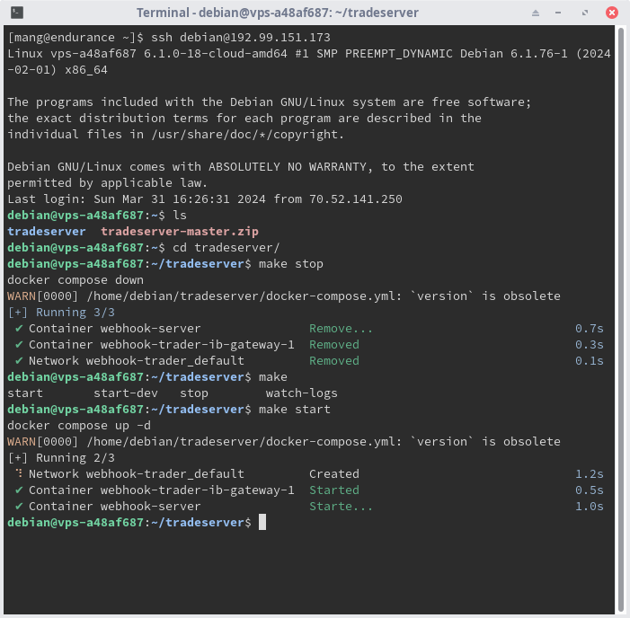

# Readme

## Connecting to ssh

1. Find the server's ip address and your username and password.
    - The username should be `debian` by default on OVH's VPS.
2. Open your terminal application:

    - On Windows find the command prompt (type `CMD` in search) or the [Windows Terminal](https://apps.microsoft.com/detail/9n0dx20hk701?rtc=1&hl=en-ca&gl=CA).

    - On Mac open the Terminal app.

3. Inside the terminal, type `ssh <username>@<serverip>` (replacing your username and server ip) and press `enter`. For example `ssh debian@192.88.142.173`.
    - If you are connecting to the server for the first time, the command prompt may ask you whether you want to trust the connection. Type `yes` and press `enter` to accept.
    - The command prompt will ask you for the password. Keep in mind that nothing will be shown in the terminal while you are typing it. Once you have typed your password press `enter` or `control + c` to cancel.
4. Once you are logged into the server, type `cd tradeserver` to get into the project's directory.
5. The following commands are available:
    - `make stop` to stop the server application.
    - `make start` to start the server application.
    - `make watch-logs` to stream the log output (live). Press `control + c` to exit.
      

## Configuring the server

There is a script to configure the server application's connection to the IB API. In order to run it:

1. Open an SSH connection to the server.
2. Change directories into the project directory by typing `cd ~/tradeserver` and pressing enter.
3. Type `./configure.py` to launch the configuration script and follow the instructions.
4. Restart the server in order for the configuration to take place:
    - Type `make stop` to stop the server.
    - Then type `make start` to start it.
